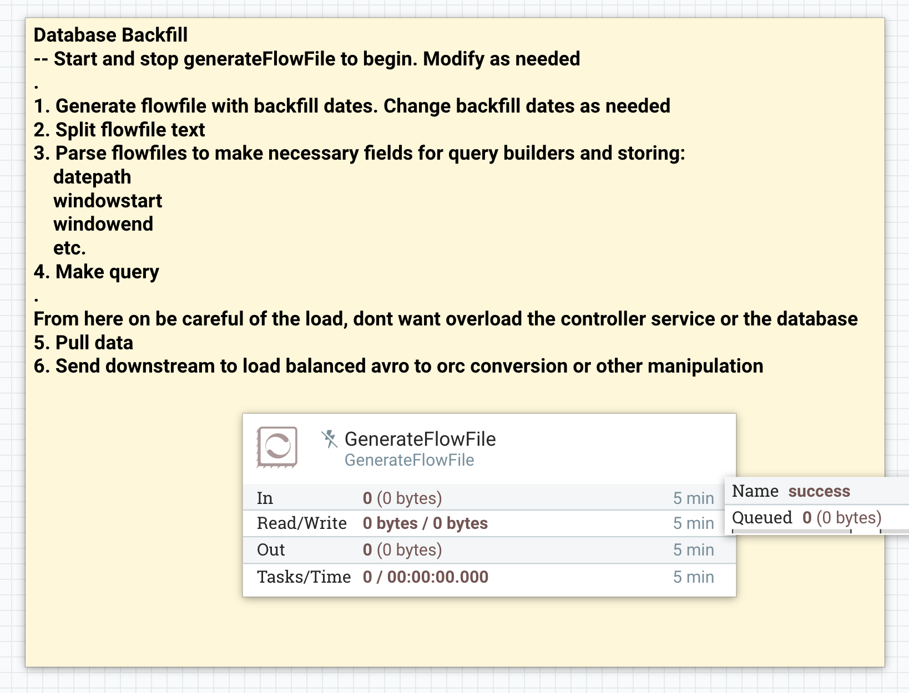
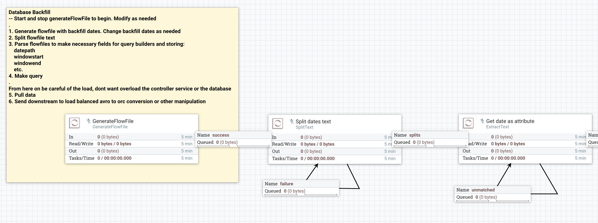
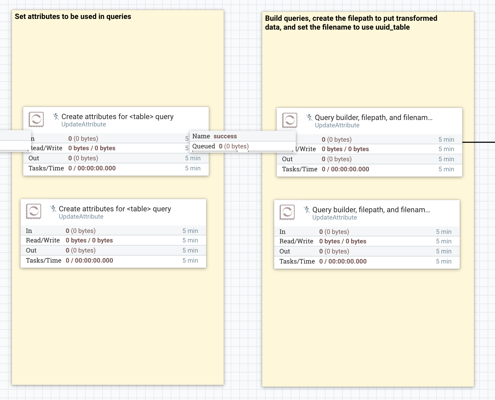
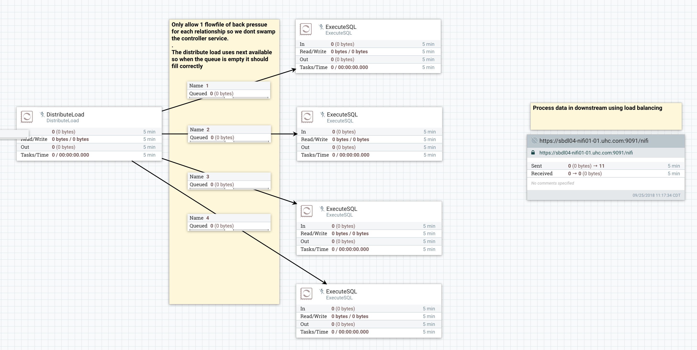

# Database Backfill

This is a template that can be set up to pull large amounts of data from database tables that contain time-stamped data. I made it because I needed to pull months (6+) of historical data into HDFS.

The template contains some instructions for setting up in addition to what is here.

## How to use

After importing the template:

1. Edit dates created in the `GenerateFlowFile` processor. Format them to suit your needs. (Section 1)

2. Update the attributes created within the `Create attributes *` to create any attributes you'll need for building any query. (Section 2)

3. Update the attributes created in the `UpdateAttribute` processors directly downstream. The attributes will be the query built, any attributes needed for storing, etc. (Section 2)

4. Run the queryies using the `ExecuteSQL` processors. (Section 3)

5. Process downstream using load balancing and store as needed.

## Images

Overall Steps

Section 1

Section 2

Section 3

