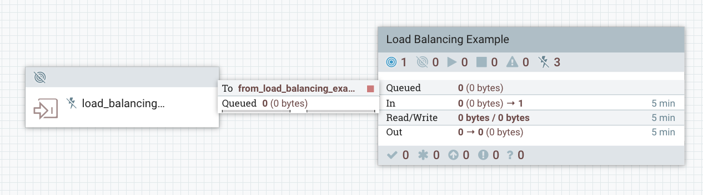
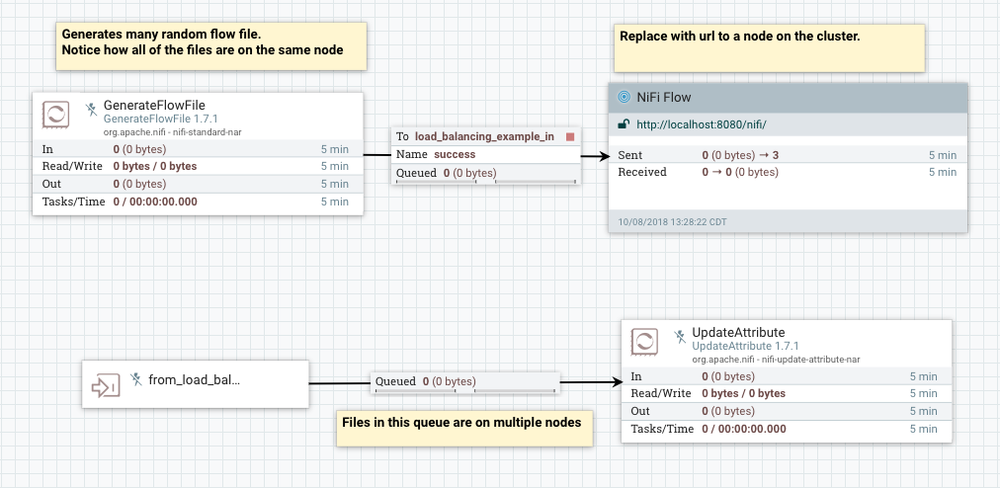

# Load Balancing Demo

This is a demo showing how flow files can be spread across a NiFi cluster to balance compute load. This can be run with a single node cluster however all the flowfiles will all exist on the one node. A cluster with at least 2 nodes will be able to see the balancing in action.

## Steps

1. Start the `GenerateFlowFile` processor to create a many flowfile to send to the input port at the root level.

2. Inspect the queue just before the `UpdateAttribute` processor to see the flowfiles on different nodes.

## Images

Root Setup

Process Group Setup

