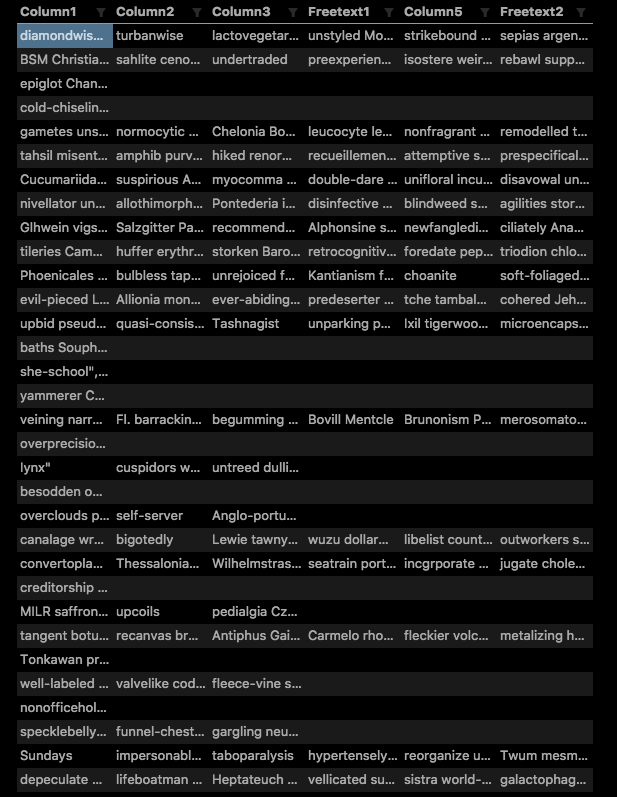

# Sanitize Free Text Column of CSV

An example of how I was able to sanitize newlines in a free text column in a csv using Jython.

The reason I made this was because when I was reading the data using spark the columns and rows we're all malformed. I'd even tried specifying read options like the `delimiter` to `,` and `quote` to `"` settings as well but nothing seemed to do the trick so I went ahead and tried to sanitize on ingest.

See examples of what a malformed csv looked like in [example-malformed.csv](example-malformed.csv) and see how it is [sanitized](example-sanitized.csv) after passing through the script. Github prettifies  the malformed csv look fine however when I was trying to read in the data using spark (with specifying delimiters, quote characters, escape characters, etc) I was still not able to get a properly formed dataset. You can see this if you open the raw version of the malformed csv.

Below is an image showing how it would look if the malformed dataset was read in without sanitization. One can see how the rows are misaligned because of \n characters in some of the free text columns:

## Steps

After importing the template:

1. Start the `GenerateFlowFile` processor to create an example flowfile containing the example contents of [example-malformed.csv](example-malformed.csv).

2. View the contents of the flowfile after it has passed through the `ExecuteScript` processor.
